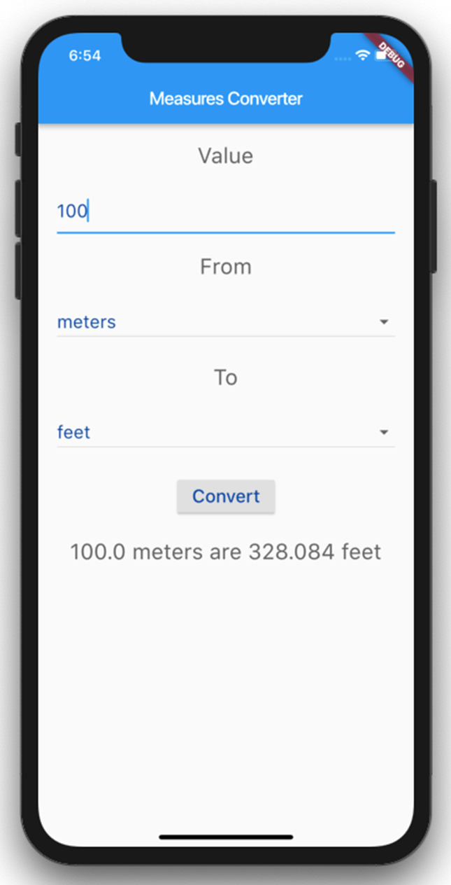

# Assignment Tasks:
Using Dart language and Flutter Framework, create a Flutter conversion app that allows users to select a measure – metric or imperial – and convert it to another measure. For example, they'll be able to convert a distance in miles to a distance in kilometers, or a weight in kilograms to a weight in pounds.  

## Output:
The following is the final layout of the Application: 

## Deliverables:

Dart Source code, manifest file, and a screenshot of the application output in the Word document and use URL link from the GitHub repository to share code. Please ensure you are following coding best practices and provide comments.  

  

## Technical Requirements:
In order to start your Flutter adventure, you will need a few tools: 
- A GitHub account
- GitHub Copilot - Your AI pair programmer to help you write code faster 
- An Android/iOS setup. You'll need to set up your Android and iOS environments to build apps. 
- The Flutter SDK. It's free, light, and open source 
Physical device/emulator/simulator. In order to try your code, you will need an Android or iOS device.
- Alternatively, you can also install an Android emulator or iOS simulator. 
- Your favorite editor. The supported editors at this time are: 
- Android Studio. It's the easiest way to install the Android SDK and emulators.  
- Visual Studio Code editor ( Getting Started)  

## Best Practices:
Refer to coding standards on the C#, JavaScript, and Dart languages coding conventions.

- [Common C# code conventions](https://learn.microsoft.com/en-us/dotnet/csharp/fundamentals/coding-style/coding-conventions)
- [JavaScript best practices](https://www.w3.org/wiki/JavaScript_best_practices)
- [Effective Dart](https://dart.dev/effective-dart)
