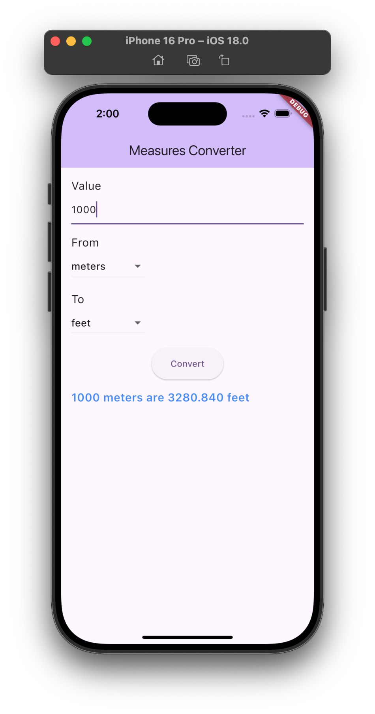

# Assignment Tasks:
Using Dart language and Flutter Framework, create a Flutter conversion app that allows users to select a measure – metric or imperial – and convert it to another measure. For example, they'll be able to convert a distance in miles to a distance in kilometers, or a weight in kilograms to a weight in pounds.  

## Technical Requirements:
In order to start your Flutter adventure, you will need a few tools: 
- A GitHub account
- GitHub Copilot - Your AI pair programmer to help you write code faster 
- An Android/iOS setup. You'll need to set up your Android and iOS environments to build apps. 
- The Flutter SDK. It's free, light, and open source 
Physical device/emulator/simulator. In order to try your code, you will need an Android or iOS device.
- Alternatively, you can also install an Android emulator or iOS simulator. 
- Your favorite editor. The supported editors at this time are: 
- Android Studio. It's the easiest way to install the Android SDK and emulators.  
- Visual Studio Code editor ( Getting Started)  

### **How the App Works (Flow):**

1. **Launch**:
   - The app starts, displaying the `ConverterScreen` as the home screen.

2. **User Interaction**:
   - The user enters a value to convert (e.g., 5 meters).
   - The user selects a **"from" unit** (e.g., meters) and a **"to" unit** (e.g., feet) from the dropdown menus.

3. **Conversion**:
   - The user presses the **Convert button**.
   - The app checks if the input is valid:
     - If invalid, an error message is shown.
     - If valid, the app uses the `convertUnits()` function to perform the conversion based on predefined conversion rates.
     - The result is shown below the Convert button (e.g., "5 meters is 16.404 feet").

4. **Display the Result**:
   - The result is displayed in the `ConversionResult` widget, showing the input value, units, and the result.

---

### **Meeting the Requirements:**
- **Unit Conversion**: The app successfully converts between different units like meters, feet, kilometers, and miles using predefined conversion rates.
- **Input Validation**: It ensures that users input valid numeric values, and shows error messages for invalid inputs.
- **User Interface**: The app uses a clean, responsive UI with Material Design principles, ensuring a good user experience.
- **Flexibility**: Users can easily select different units for conversion, and the app supports multiple conversions between various unit types.

This structure ensures the app performs unit conversions efficiently and provides feedback to the user in case of errors or invalid input.

## Output:
The following is the final 5 layout Output of the Application: 

### iOS

### Android

### Web

### Windows

### MacOS
 

## Best Practices:
Refer to coding standards on the C#, JavaScript, and Dart languages coding conventions.

- [Common C# code conventions](https://learn.microsoft.com/en-us/dotnet/csharp/fundamentals/coding-style/coding-conventions)
- [JavaScript best practices](https://www.w3.org/wiki/JavaScript_best_practices)
- [Effective Dart](https://dart.dev/effective-dart)

## Flutter Help

This project is a starting point for a Flutter application.

A few resources to get you started if this is your first Flutter project:

- [Lab: Write your first Flutter app](https://docs.flutter.dev/get-started/codelab)
- [Cookbook: Useful Flutter samples](https://docs.flutter.dev/cookbook)

For help getting started with Flutter development, view the
[online documentation](https://docs.flutter.dev/), which offers tutorials,
samples, guidance on mobile development, and a full API reference.
